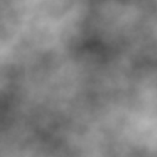
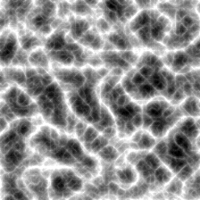
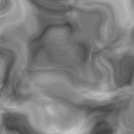
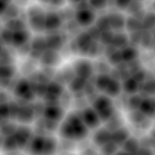
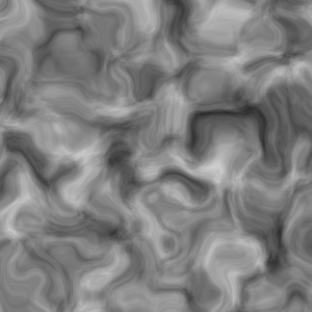
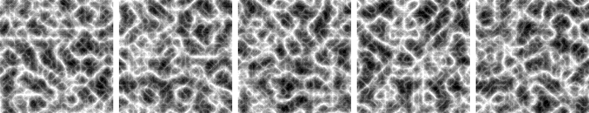
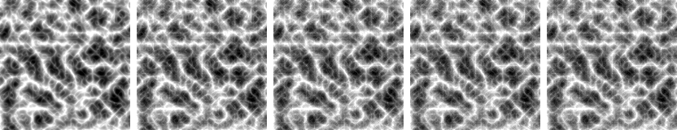
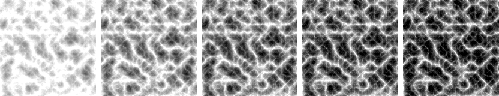

# tilekiln

Tile-addressable procedural texture synthesis, with the parameter
stability actually measured.

Two halves, in one crate because each is worth more with the other.

| soft clouds | cracked rock | marbled vein | cellular |
|---|---|---|---|
|  |  |  |  |


## Synthesis

A `Material` is a small record of knobs. Sampling it is a pure function
of position, with no stream state anywhere, so tile (10⁶, −4) costs what
tile (0, 0) costs and rendering it does not depend on which tiles came
before. Adjacent tiles meet without a seam because both evaluate the
same continuous field.

Lattice arithmetic runs in `f64`. That is not fussiness: with `f32`
coordinates, tile 2²⁰ rendered only 2,207 distinct values out of 65,536,
because `f32`'s ulp at that magnitude exceeds the pixel step and
adjacent pixels collapse into one lattice cell. The tile still rendered,
and still rendered fast, which is what made it easy to miss.

The lattice cell is an `i32`, because that is the widest integer WGSL
has, so the plane is large rather than unbounded: the field repeats every
2³² cells. `Material::max_tile()` returns the last index before that, and
nothing stops you going past it. Two tests pin the behaviour, one that
every tile inside the range is distinct and one that the repeat lands
exactly where the docs say.

That second test exists because the first version of this README was
wrong. The far-tile strip below used to run out to 2⁴⁰, which at
frequency 6 is exactly 1536 periods, and the last tile was a
byte-for-byte copy of the first. It looked completely convincing. The
original test checked that a distant tile still had *detail*, which it
did, rather than that it was a different *tile*.

Four tiles in a 2×2 block, rendered independently. Adjacent tiles
evaluate the same continuous field at the same coordinates, so there is
no seam to hide:



The same material at tiles 0, 2¹⁰, 2²⁰, 2²⁶ and 357,913,941, the last
being `max_tile()` at this frequency. Different content, identical
detail, identical cost:



```rust
use tilekiln::{Material, TileId};

let m = Material { frequency: 6.0, octaves: 5, ..Default::default() };
let tile = m.render_tile(TileId::new(1_000_000, -4), 256);
```

Every operation in the synthesis path is `+`, `-` or `*` on `f32`, plus
one correctly-rounded `sqrt`. WGSL specifies those exactly and leaves
`sin`, `exp` and `pow` to the driver, so gradients come from a hashed
table rather than trigonometry, the interpolant is a quintic polynomial,
and lacunarity is fixed at 2 so the octave scale factors are exact.
Coordinates travel as an integer cell plus a fractional offset, so a
tile hundreds of millions out keeps its detail and the octave loop stays
in step on both sides.

Whether that discipline gets you bit-identical output turns out to depend
on the driver, which was not the expected answer. A shader compiler may
fuse a multiply and an add into a single `fma`, rounding once where the
host rounds twice, and WGSL provides no way to forbid it. Nearly every
line of the synthesis path is a multiply followed by an add.

Same shader, nine basis and pattern combinations, one 64×64 tile:

| driver | bit-identical | worst error |
|---|---|---|
| llvmpipe (software Vulkan) | 8 of 9 | 1.2e-7 |
| Apple M4 Max (Metal) | 0 of 9 | 7.2e-7 |

llvmpipe matches the host almost everywhere, so the arithmetic is
expressed exactly. Metal fuses, so it does not. WGSL permits both.

The portable promise is therefore a bound. Across 311,040 samples the
worst disagreement was 8.9e-6, against an 8-bit output level of 3.9e-3,
about 440 times larger. The picture is the same picture. Guaranteeing
exactness on every driver would mean dropping floats for fixed point,
which is how the analysis engine underneath manages a bit-exact device
path, and that is not built here.

## Stability

A texture tool will happily expose five sliders and say nothing about
the fact that one of them reshuffles the whole material on a 2% nudge
while another does almost nothing. This measures it.

```rust
use tilekiln::{analysis, Material};

for s in analysis::sensitivities(&Material::default(), &Default::default()) {
    println!("{:<12} {:.5}", s.knob, s.spread);
}
```

Perturb one knob, re-render, measure how far a chosen feature moved.
The estimator underneath is
[perturbation-kernel](https://github.com/godofecht/perturbation-kernel),
so an analysis is a pure function of `(material, knob, settings)` and
reproduces bit for bit across machines, thread counts and CPU vector
widths. An analysis whose answer depended on the core count would not be
evidence of anything.

Numbers are easy to nod along to and hard to feel, so here is the same
material with the knob the analysis ranks *least* sensitive stepped
±2 units:



and the knob it ranks *most* sensitive, stepped by the same ±2 units:



Both strips move the same distance along a slider. One is a material;
the other is five materials. The analysis called that before rendering
anything.

## What it finds

`cargo run --release --example which_knob_is_dangerous`

```
preset                          mean            contrast        edge_density   spectral_centroid
------------------------------------------------------------------------------------------------
soft clouds         frequency 0.0007     contrast 0.0011    frequency 0.0003    frequency 0.0090
cracked rock        sharpness 0.0069    sharpness 0.0059    sharpness 0.0057    frequency 0.1294
marbled vein       frequency 0.0003     frequency 0.0014    frequency 0.0009    frequency 0.0335
```

**The dangerous knob is not the same knob.** Holding the measurement at
`mean`, `sharpness` dominates for a ridged material while `frequency`
dominates for the other two. An artist who learns "watch the frequency
slider" on one material carries the wrong instinct to the next.

**The measurement decides the answer.** Read the `cracked rock` row
across: `sharpness` tops three columns and `frequency` tops the fourth.
Spectral centroid measures frequency content, so perturbing the
frequency knob moves it almost by definition — which hides the fact that
`sharpness` is what actually destabilises a ridged material. Pick the
measurement that matches the thing you cannot afford to have change.

**Sensitivity is not uniform along a knob.** Sweeping frequency for the
ridged preset:

```
  frequency      spread
       1.00     0.00998  #
       3.36     0.08259  ##########
       4.55     0.04878  ######
       6.91     0.11427  #############
       9.27     0.25274  ##############################
      10.45     0.17225  ####################
      11.64     0.33000  #######################################
      14.00     0.37557  ############################################
```

Growth of about 38x across the range, but not monotone. Re-running the
sweep under two further seeds moves every point by at most ~1%, so the
dips at 4.6 and 10.5 are structure in the material rather than noise in
the ensemble: narrow bands where this material tolerates a nudge, beside
bands where it does not.

## Caveats the crate enforces

**Resolution is part of the measurement.** `edge_density` and
`spectral_centroid` read pixels, so they cannot see structure the tile
does not resolve. Octaves past Nyquist *lower* measured edge density,
because the fractal sum normalises by accumulated amplitude while
contributing nothing visible. An analysis run at too small a tile will
report the octaves knob as stabilising, which is an artefact of
sampling. `features` documents the numbers and a test pins them.

**Quantised knobs need stochastic rounding.** A 5% nudge on
`octaves = 4` lands in 3.8..=4.2 and nearest-rounds straight back to 4.
Perturbing integer knobs like continuous ones measures nothing and
reports it as perfect stability, which is the most misleading answer
available. They are rounded stochastically instead, so the step is
crossed with probability equal to the fractional part.

**Only `mean` carries an error bound.** perturbation-kernel derives a
non-asymptotic bound only for functionals with a declared Wasserstein-1
Lipschitz constant. Tile values live in `[0, 1]`, so `mean` is exactly
1-Lipschitz. `contrast` is quadratic in the values, and `edge_density`
and `spectral_centroid` depend on pixel *arrangement*, so they are not
functionals of the empirical measure at all. Each returns `None` and the
analysis omits the bound rather than inventing a constant.

## Status

Early, and honest about it.

Working and tested: synthesis, tile addressing, the four features, the
stability analysis, and a dependency-free PNG writer. 33 tests, clippy
clean.

The PNG writer uses stored DEFLATE, so files cost roughly their raw byte
count. That is the price of not taking an image-codec dependency in a
crate whose argument is that it has no hidden state, and it is paid in
the repository rather than at run time.

The GPU path is written and measured, under the `gpu` feature. It is
bit-identical on drivers that do not fuse and within 8.9e-6 on ones that
do, for the reason given above. `tests/gpu.rs` pins the bound, reports
which combinations came out exact, and skips cleanly with no adapter; CI
runs it on llvmpipe so both rows of that table stay honest.

## License

MIT.
